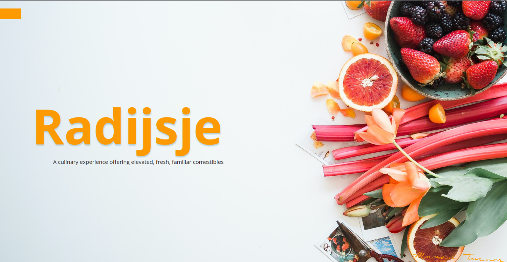

# Radijsje
Radijsje was a site created for a pop-up seasonal restaurant located in Southern Virginia. It was one of the first designs I ever created years ago, and I remember having a blast making it.

**Link to project:** https://m47o.github.io/radijsje/
## How It's Made:

**Tech used:** HTML, CSS

This is a static site made entirely with HTML and CSS. After the actual production site was taken down, I included links to my Twitter and Github on the site, and used FontAwesome via CDN for the relevant icons. (Thus the script tags)

## Looking back:

- If I were to make this site again, I would undoubtedly house the menu.pdf on its own page (e.g. radijsje.com/menu.pdf) as using an embed to display it among the rest of the main page seems to slow the site down significantly. Chrome specifically seems to hang a bit when scrolling past it.
- Knowing a lot more about responsive design, I'd definitely stick to using relative units
- Can I just take a moment to say how proud I am of past me for using custom properties on his first site :)
- Holy moly, that time to first meaningful paint... yikes. Gotta remember to compress your images, folks.
